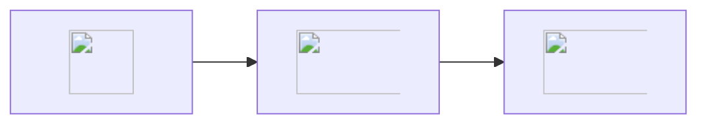

[](https://doi.org/10.5281/zenodo.13731940)
[](https://pypi.org/project/biblatex2qmd/)
[](https://pypi.org/project/biblatex2qmd/)

# BibLaTeX2qmd

BibLaTeX2qmd is a Python package that processes BibLaTeX files, extracts information from each entry, creates individual Markdown files for each entry, and generates a combined corpus file.



## Features

- Validates BibLaTeX files
- Extracts key information from BibLaTeX entries
- Generates individual Markdown files for each entry
- Creates a combined corpus file
- Handles custom notes and keywords

## Installation

You can install BibLaTeX Processor using pip:

```bash
pip install biblatex2qmd
```

## Usage

Here's a basic example of how to use BibLaTeX Processor:

```python
from biblatex_processor import process_entries

input_file = 'path/to/your/bibfile.bib'
output_directory = 'path/to/output/directory'
fields_to_extract = ['author_last_name', 'year', 'title', 'ID', 'abstract', 'keywords', 'note']

process_entries(input_file, output_directory, fields_to_extract)
```

This will process the BibLaTeX file, create individual Markdown files in the `output_directory/abstract` folder, and generate a corpus file in the `output_directory/corpus` folder.

## Configuration

You can customize the fields to extract by modifying the `fields_to_extract` list. The available fields are:

- 'author_last_name'
- 'year'
- 'title'
- 'ID'
- 'abstract'
- 'keywords'
- 'note'

## Contributing

Contributions are welcome! Please feel free to submit a Pull Request.

## License

This project is licensed under the MIT License - see the [LICENSE](LICENSE) file for details.

## Acknowledgments

- Thanks to the creators of the `bibtexparser` library, which this project heavily relies on.

## Contact

If you have any questions or feedback, please open an issue on the GitHub repository.
